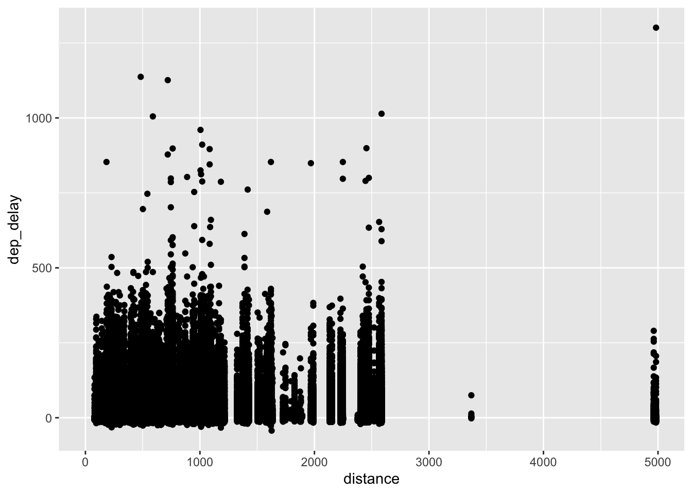
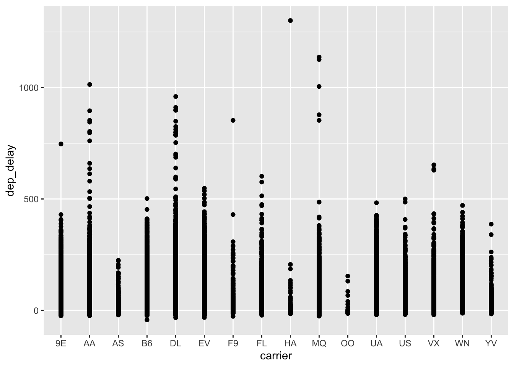
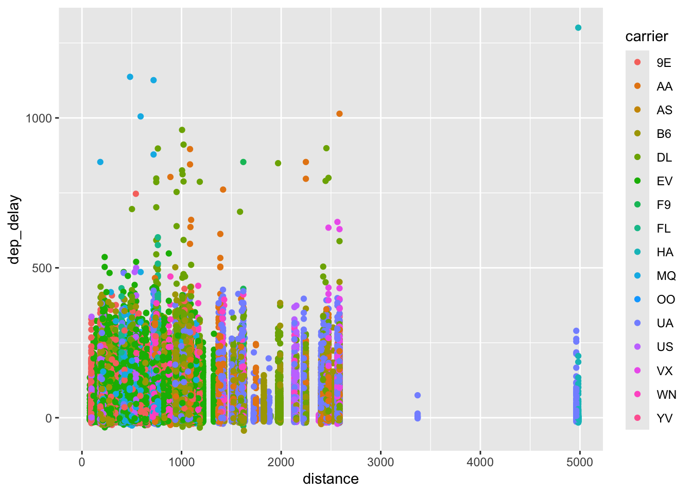

::: {.cell}

```{.r .cell-code}
library(tidyverse)
library(nycflights13)
```
:::

::: {.cell}

```{.r .cell-code}
ggplot(data = flights, mapping = aes(x = distance, y = dep_delay,)) + geom_point()
```

::: {.cell-output-display}
{width=672}
:::
:::

::: {.cell}

```{.r .cell-code}
ggplot(data = flights, mapping = aes(x = carrier, y = dep_delay,)) + geom_point()
```

::: {.cell-output-display}
{width=672}
:::
:::

::: {.cell}

```{.r .cell-code}
ggplot(data = flights, mapping = aes(x = distance, y = dep_delay, color= carrier )) + geom_point()
```

::: {.cell-output-display}
{width=672}
:::
:::

::: {.cell}

```{.r .cell-code}
glimpse(flights)
```

::: {.cell-output .cell-output-stdout}

```
Rows: 336,776
Columns: 19
$ year           <int> 2013, 2013, 2013, 2013, 2013, 2013, 2013, 2013, 2013, 2…
$ month          <int> 1, 1, 1, 1, 1, 1, 1, 1, 1, 1, 1, 1, 1, 1, 1, 1, 1, 1, 1…
$ day            <int> 1, 1, 1, 1, 1, 1, 1, 1, 1, 1, 1, 1, 1, 1, 1, 1, 1, 1, 1…
$ dep_time       <int> 517, 533, 542, 544, 554, 554, 555, 557, 557, 558, 558, …
$ sched_dep_time <int> 515, 529, 540, 545, 600, 558, 600, 600, 600, 600, 600, …
$ dep_delay      <dbl> 2, 4, 2, -1, -6, -4, -5, -3, -3, -2, -2, -2, -2, -2, -1…
$ arr_time       <int> 830, 850, 923, 1004, 812, 740, 913, 709, 838, 753, 849,…
$ sched_arr_time <int> 819, 830, 850, 1022, 837, 728, 854, 723, 846, 745, 851,…
$ arr_delay      <dbl> 11, 20, 33, -18, -25, 12, 19, -14, -8, 8, -2, -3, 7, -1…
$ carrier        <chr> "UA", "UA", "AA", "B6", "DL", "UA", "B6", "EV", "B6", "…
$ flight         <int> 1545, 1714, 1141, 725, 461, 1696, 507, 5708, 79, 301, 4…
$ tailnum        <chr> "N14228", "N24211", "N619AA", "N804JB", "N668DN", "N394…
$ origin         <chr> "EWR", "LGA", "JFK", "JFK", "LGA", "EWR", "EWR", "LGA",…
$ dest           <chr> "IAH", "IAH", "MIA", "BQN", "ATL", "ORD", "FLL", "IAD",…
$ air_time       <dbl> 227, 227, 160, 183, 116, 150, 158, 53, 140, 138, 149, 1…
$ distance       <dbl> 1400, 1416, 1089, 1576, 762, 719, 1065, 229, 944, 733, …
$ hour           <dbl> 5, 5, 5, 5, 6, 5, 6, 6, 6, 6, 6, 6, 6, 6, 6, 5, 6, 6, 6…
$ minute         <dbl> 15, 29, 40, 45, 0, 58, 0, 0, 0, 0, 0, 0, 0, 0, 0, 59, 0…
$ time_hour      <dttm> 2013-01-01 05:00:00, 2013-01-01 05:00:00, 2013-01-01 0…
```


:::

```{.r .cell-code}
flights %>% head()
```

::: {.cell-output .cell-output-stdout}

```
# A tibble: 6 × 19
   year month   day dep_time sched_dep_time dep_delay arr_time sched_arr_time
  <int> <int> <int>    <int>          <int>     <dbl>    <int>          <int>
1  2013     1     1      517            515         2      830            819
2  2013     1     1      533            529         4      850            830
3  2013     1     1      542            540         2      923            850
4  2013     1     1      544            545        -1     1004           1022
5  2013     1     1      554            600        -6      812            837
6  2013     1     1      554            558        -4      740            728
# ℹ 11 more variables: arr_delay <dbl>, carrier <chr>, flight <int>,
#   tailnum <chr>, origin <chr>, dest <chr>, air_time <dbl>, distance <dbl>,
#   hour <dbl>, minute <dbl>, time_hour <dttm>
```


:::
:::


##What variable I decided to look at separately was distance and carrier. The way that I saw how they correlated was by using dep_dalays. What I saw with department delays was that on average the delays were in a range of distance of 20 to 260 with an outlier of 5000 miles. The carrier that had the longest delay was HA(Houston?) and the airline with the most outliers is MQ(I don't know this code)##

\

##As we compared these variables using color we were able to see a different picture. We could see that the highest department delay within distance is AA. But all of the extreme distance out liars come from a specific carrier which is OO, MQ and HA. However most of the data points are so close together that it is hard to differentiate##
